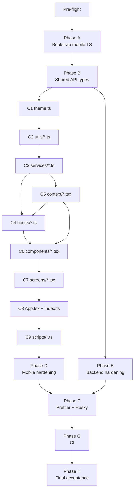

# TypeScript Migration Runbook — MTG Card Scanner

**Version:** 1.0  
**Date:** 2026-05-20  
**Scope:** Full codebase — `mobile/` (JS → TS) + `src/` backend (TS hardening)  
**Strategy:** Incremental — one atomic commit per sub-step, app stays runnable throughout.  
**Target branch:** `chore/ts-migration` (branched from `main`)

---

## Table of Contents

1. [Mission & Success Criteria](#1-mission--success-criteria)
2. [Audit Baseline](#2-audit-baseline)
3. [Pre-flight Checklist](#3-pre-flight-checklist)
4. [Phase A — Bootstrap Mobile TypeScript](#phase-a--bootstrap-mobile-typescript)
5. [Phase B — Shared API Contract](#phase-b--shared-api-contract)
6. [Phase C — Incremental Mobile Migration](#phase-c--incremental-mobile-migration)
7. [Phase D — Mobile Hardening (ratchet)](#phase-d--mobile-hardening-ratchet)
8. [Phase E — Backend Hardening](#phase-e--backend-hardening)
9. [Phase F — Quality Tooling](#phase-f--quality-tooling)
10. [Phase G — CI](#phase-g--ci)
11. [Phase H — Final Acceptance & Cleanup](#phase-h--final-acceptance--cleanup)
12. [Cross-cutting Conventions](#cross-cutting-conventions)
13. [Guardrails & Rollback](#guardrails--rollback)
14. [Appendix A — Phase Dependency Diagram](#appendix-a--phase-dependency-diagram)
15. [Appendix B — File Migration Table](#appendix-b--file-migration-table)
16. [Appendix C — Reference Links](#appendix-c--reference-links)

---

## 1. Mission & Success Criteria

Convert the entire codebase to idiomatic, strictly-typed TypeScript while preserving runtime behaviour unchanged.

### Definition of Done

| Check | Command | Expected |
|---|---|---|
| Backend typecheck | `npx tsc --noEmit -p tsconfig.json` (root) | 0 errors |
| Mobile typecheck | `npx tsc --noEmit -p mobile/tsconfig.json` | 0 errors |
| Backend lint | `npm run lint` (root) | 0 errors |
| Mobile lint | `npm run lint` (mobile/) | 0 errors |
| Backend tests | `npm test` (root) | All pass |
| No residual JS (mobile src) | see §3 verification command | 0 files |
| App starts | `cd mobile && npx expo start` | No compile error, QR shown |
| Pre-commit hooks | `git commit` on a dirty file | hook blocks on violation |
| CI green | push to `chore/ts-migration` | All GitHub Actions jobs pass |

---

## 2. Audit Baseline

### Backend (`src/`) — already TypeScript, needs hardening

| File | Issue |
|---|---|
| `src/server/controllers/authController.ts` lines 40, 74 | `catch (error: any)` → must be `unknown` |
| `src/server/controllers/cardController.ts` lines 88, 207 | `(req as any).file` → needs Multer type augmentation |
| `src/server/controllers/authController.ts` lines 43–46 | `error.message` / `error.stack` leaked to client in 500 response |
| All controllers | No runtime validation on `req.body` (relies on manual checks) |
| `tsconfig.json` | Missing `noImplicitOverride`, `noFallthroughCasesInSwitch`, `noPropertyAccessFromIndexSignature` |
| `eslint.config.js` | `no-explicit-any: "warn"` — must become `"error"` |
| `debug-signup.js` (root) | Plain JS one-off script — move to `scripts/debug-signup.ts` |

### Mobile (`mobile/`) — 100% JavaScript, no tsconfig

| Metric | Value |
|---|---|
| JS files to convert | 30 (see Appendix B) |
| Babel plugin | `@babel/plugin-transform-typescript` already loaded — Metro ready |
| Types installed | None |
| ESLint | `eslint-config-expo` flat config, no TS rules |
| Tests | None |
| Path aliases | Defined in `babel.config.js`, not yet in tsconfig |

---

## 3. Pre-flight Checklist

Run all commands from the repo root unless noted.

### 3.1 Create migration branch

```bash
git checkout main
git pull origin main
git checkout -b chore/ts-migration
git tag migration-checkpoint-start
```

PowerShell equivalent:
```powershell
git checkout main
git pull origin main
git checkout -b chore/ts-migration
git tag migration-checkpoint-start
```

### 3.2 Record baseline

```bash
# Backend — must be green before touching anything
npm ci
npm test
npm run build

# Mobile — record current start (do not proceed if expo crashes on startup)
cd mobile && npm ci && cd ..
```

### 3.3 Verify no `.ts`/`.tsx` already exist in mobile/src

```bash
# Bash
find mobile/src -name "*.ts" -o -name "*.tsx" | sort

# PowerShell
Get-ChildItem -Path mobile\src -Recurse -Include "*.ts","*.tsx" | Select-Object FullName
```

Expected output: empty (no files yet).

### 3.4 Count JS files to convert (should match Appendix B)

```bash
# Bash
find mobile/src mobile/scripts -name "*.js" | wc -l
find . -maxdepth 1 -name "*.js" | grep -v node_modules

# PowerShell
(Get-ChildItem -Path mobile\src, mobile\scripts -Recurse -Filter "*.js").Count
Get-ChildItem -Path . -MaxDepth 1 -Filter "*.js"
```

---

## Phase A — Bootstrap Mobile TypeScript

**Goal:** TypeScript tooling in `mobile/` with `allowJs: true` so existing JS files still compile while we convert.  
**Commit message:** `chore(mobile): bootstrap TypeScript toolchain`

### A.1 Install dependencies

```bash
cd mobile
npm install --save-dev \
  typescript \
  @types/react \
  @types/react-native \
  @typescript-eslint/eslint-plugin \
  @typescript-eslint/parser \
  eslint-plugin-react-hooks \
  eslint-plugin-react
cd ..
```

> Note: `eslint-config-expo` is already in `mobile/devDependencies`. It depends on `@typescript-eslint/*` internally, so the explicit installs ensure the right versions.

### A.2 Create `mobile/tsconfig.json`

```json
{
  "extends": "expo/tsconfig.base",
  "compilerOptions": {
    "strict": true,
    "noUncheckedIndexedAccess": true,
    "exactOptionalPropertyTypes": true,
    "noImplicitOverride": true,
    "noFallthroughCasesInSwitch": true,
    "allowJs": true,
    "jsx": "react-native",
    "baseUrl": ".",
    "paths": {
      "@components/*": ["./src/components/*"],
      "@screens/*":    ["./src/screens/*"],
      "@hooks/*":      ["./src/hooks/*"],
      "@services/*":   ["./src/services/*"],
      "@context/*":    ["./src/context/*"],
      "@utils/*":      ["./src/utils/*"],
      "@navigation/*": ["./src/navigation/*"]
    }
  },
  "include": [
    "**/*.ts",
    "**/*.tsx",
    "**/*.js",
    "**/*.jsx"
  ],
  "exclude": [
    "node_modules",
    "babel.config.js",
    "metro.config.js",
    "eslint.config.js"
  ]
}
```

### A.3 Replace `mobile/eslint.config.js`

Replace the entire file with:

```js
const { defineConfig } = require('eslint/config');
const expoConfig = require('eslint-config-expo/flat');
const tseslint = require('typescript-eslint');

module.exports = defineConfig([
  ...expoConfig,
  ...tseslint.configs.recommended,
  {
    rules: {
      '@typescript-eslint/no-explicit-any': 'warn',          // raised to 'error' in Phase D
      '@typescript-eslint/no-unused-vars': 'warn',
      '@typescript-eslint/consistent-type-imports': 'warn',
      'react-hooks/rules-of-hooks': 'error',
      'react-hooks/exhaustive-deps': 'warn',                 // raised to 'error' in Phase D
    },
  },
  {
    ignores: ['dist/', 'node_modules/', '.expo/'],
  },
]);
```

### A.4 Add scripts to `mobile/package.json`

Add to the `"scripts"` section:

```json
"typecheck": "tsc --noEmit",
"lint":      "eslint \"src/**/*.{ts,tsx,js,jsx}\" \"App.{ts,tsx,js,jsx}\" \"index.{ts,tsx,js}\"",
"lint:fix":  "eslint --fix \"src/**/*.{ts,tsx,js,jsx}\" \"App.{ts,tsx,js,jsx}\" \"index.{ts,tsx,js}\"",
"format":    "prettier --write \"src/**/*.{ts,tsx,js,jsx}\" \"App.{ts,tsx,js,jsx}\""
```

### A.5 Go/no-go verification

```bash
# PowerShell
cd mobile
npx tsc --noEmit
# Expected: warnings only (allowJs means JS files may have implicit-any noise) — no hard errors

npm run lint
# Expected: warnings, 0 errors that block

cd ..
git add mobile/tsconfig.json mobile/eslint.config.js mobile/package.json mobile/package-lock.json
git commit -m "chore(mobile): bootstrap TypeScript toolchain"
git tag migration-checkpoint-A
```

---

## Phase B — Shared API Contract

**Goal:** Single source of truth for API types, shared between `src/` (backend) and `mobile/`.  
**Commit message:** `chore: add shared API type definitions`

### B.1 Create `src/shared/apiTypes.ts` (backend source of truth)

The backend already has `src/server/models/Card.ts` with `Card`, `NewCard`, `CardUpdate`. Extend it with all API payload shapes:

```typescript
// src/shared/apiTypes.ts
// Re-export existing model types
export type { Card, NewCard, CardUpdate } from '../server/models/Card.js';

// Auth
export interface User {
  id: string;
  email: string;
  username: string;
  createdAt?: string;
}

export interface SignupRequest {
  email: string;
  password: string;
  username: string;
}

export interface LoginRequest {
  email: string;
  password: string;
}

export interface AuthResponse {
  user: User;
  accessToken: string;
  refreshToken: string;
}

export interface RefreshResponse {
  accessToken: string;
}

// Tags
export interface TagInfo {
  name: string;
  count: number;
}

export interface TagRequest {
  cardIds: string[];
  add?: string[];
  remove?: string[];
}

export interface RenameTagRequest {
  from: string;
  to: string;
}

// OCR
export interface RecognizeResponse {
  text: string;
  cardName: string | null;
}

// Sync
export interface SyncResponse {
  changes: Card[];
  cursor: string;
}

// API error shape
export interface ApiError {
  error: string;
  details?: string;
}
```

### B.2 Create `mobile/src/types/api.ts` (mobile mirror)

Since `mobile/` is a separate package without a monorepo manager, maintain a mirror. The types must stay in sync with `src/shared/apiTypes.ts`. Add a header comment making this explicit:

```typescript
// mobile/src/types/api.ts
// MIRROR of src/shared/apiTypes.ts — keep in sync manually or via a shared package.
// Source of truth: src/shared/apiTypes.ts (backend).

export interface User {
  id: string;
  email: string;
  username: string;
  createdAt?: string;
}

export interface Card {
  id: string;
  ownerId: string;
  name: string;
  edition: string | null;
  setName: string | null;
  collectorNumber: string | null;
  scryfallId: string | null;
  manaCost: string | null;
  typeLine: string | null;
  oracleText: string | null;
  colors: string[] | null;
  rarity: string | null;
  imageUrl: string | null;
  quantity: number;
  isFoil: boolean;
  priceUsd: number | null;
  priceEur: number | null;
  priceUsdFoil: number | null;
  tags: string[];
  createdAt: string;
  updatedAt: string;
}

export type NewCard = Omit<Card, 'id' | 'ownerId' | 'createdAt' | 'updatedAt'> & {
  quantity?: number;
  isFoil?: boolean;
  tags?: string[];
};

export interface CardUpdate {
  quantity?: number;
  isFoil?: boolean;
  priceUsd?: number | null;
  priceEur?: number | null;
  priceUsdFoil?: number | null;
  tags?: string[];
}

export interface AuthResponse {
  user: User;
  accessToken: string;
  refreshToken: string;
}

export interface TagInfo {
  name: string;
  count: number;
}

export interface TagRequest {
  cardIds: string[];
  add?: string[];
  remove?: string[];
}

export interface RecognizeResponse {
  text: string;
  cardName: string | null;
}

export interface ApiError {
  error: string;
  details?: string;
}
```

### B.3 Go/no-go verification

```bash
# Backend compiles with new file
npx tsc --noEmit -p tsconfig.json

# Mobile typecheck still passes
cd mobile && npx tsc --noEmit && cd ..

git add src/shared/apiTypes.ts mobile/src/types/api.ts
git commit -m "chore: add shared API type definitions"
git tag migration-checkpoint-B
```

---

## Phase C — Incremental Mobile Migration

**Rule:** One sub-step = one commit = `npm run typecheck` green (in `mobile/`) before proceeding.

### C1 — `theme.js` → `theme.ts`

**Action:** Rename `mobile/src/theme.js` to `mobile/src/theme.ts`. No other changes needed — the file is already well-structured with const objects. Add explicit return type to `getRarityColor`:

```typescript
// Add to getRarityColor signature:
export const getRarityColor = (rarity: string | null | undefined): { fg: string; bg: string } => {
```

**Verification:**
```bash
cd mobile && npx tsc --noEmit && cd ..
git add mobile/src/theme.ts
git rm mobile/src/theme.js
git commit -m "chore(mobile/C1): theme.js → theme.ts"
git tag migration-checkpoint-C1
```

### C2 — `utils/*.js` → `.ts`

**Files:** `mobile/src/utils/format.js`, `mobile/src/utils/setInfoCache.js`

**Action:** Rename each `.js` to `.ts`. Add explicit parameter and return types. Example for `format.ts`:
- Any function taking a `string | null` param should declare that.
- Return type should be explicit (`string`, `string | null`, etc.).

For `setInfoCache.ts`:
- Import `Card` type from `../types/api` if any card-shaped object is cached.
- Type the cache map: `Map<string, CachedSetInfo>` where `CachedSetInfo` is a local interface.

**Verification:**
```bash
cd mobile && npx tsc --noEmit && cd ..
git add mobile/src/utils/
git commit -m "chore(mobile/C2): utils/*.js → .ts"
git tag migration-checkpoint-C2
```

### C3 — `services/*.js` → `.ts`

**Files:**
- `mobile/src/services/api.js` → `api.ts`
- `mobile/src/services/scryfallService.js` → `scryfallService.ts`
- `mobile/src/services/ocrService.js` → `ocrService.ts`

**Key typing work for `api.ts`:**

1. Import types from `../types/api`:
   ```typescript
   import type { AuthResponse, Card, CardUpdate, NewCard, TagInfo, TagRequest, RecognizeResponse } from '../types/api';
   ```

2. Type the module-level token variable:
   ```typescript
   let _authToken: string | null = null;
   ```

3. Type the `request` function — define a `RequestOptions` interface:
   ```typescript
   interface RequestOptions {
     method?: 'GET' | 'POST' | 'PUT' | 'PATCH' | 'DELETE';
     body?: unknown;
     headers?: Record<string, string>;
     timeoutMs?: number;
     signal?: AbortSignal;
   }
   ```

4. The `err.status` and `err.payload` assignments in `parseError` require extending `Error`. Define:
   ```typescript
   class ApiError extends Error {
     status: number;
     payload: unknown;
     constructor(message: string, status: number, payload: unknown) {
       super(message);
       this.name = 'ApiError';
       this.status = status;
       this.payload = payload;
     }
   }
   ```
   Replace `const err = new Error(message); err.status = ...; err.payload = ...;` with `new ApiError(...)`.

5. Type each exported function with typed return promises:
   ```typescript
   export const loginRequest = (credentials: { email: string; password: string }): Promise<AuthResponse> => ...
   export const getCards = (): Promise<Card[]> => ...
   export const addCard = (payload: NewCard): Promise<Card> => ...
   export const updateCard = (cardId: string, patch: CardUpdate): Promise<Card> => ...
   export const deleteCard = (cardId: string): Promise<null> => ...
   export const getTags = (): Promise<TagInfo[]> => ...
   export const tagCards = (payload: TagRequest): Promise<{ ok: boolean }> => ...
   export const recognizeCardImage = (opts: { uri: string; mimeType?: string }): Promise<RecognizeResponse> => ...
   ```

**Key typing work for `scryfallService.ts`:**

1. Define a `ScryfallCard` interface for the raw Scryfall API response (local, not exported):
   ```typescript
   interface ScryfallCard {
     id: string;
     name: string;
     mana_cost?: string;
     type_line?: string;
     oracle_text?: string;
     colors?: string[];
     rarity: string;
     set: string;
     set_name: string;
     collector_number: string;
     released_at?: string;
     image_uris?: { normal?: string; large?: string; small?: string };
     card_faces?: Array<{ image_uris?: { normal?: string; large?: string } }>;
     prices?: { usd?: string | null; eur?: string | null; usd_foil?: string | null };
   }
   ```

2. Type `normalizeCardPayload` return as `NewCard`.

3. Type `requestMutex` as `Promise<unknown>`.

4. Type `lastRequestStartMs` as `number`.

**Key typing work for `ocrService.ts`:** Straightforward — type any function parameters and return values.

**Verification:**
```bash
cd mobile && npx tsc --noEmit && cd ..
git add mobile/src/services/
git commit -m "chore(mobile/C3): services/*.js → .ts with typed API responses"
git tag migration-checkpoint-C3
```

### C4 — `hooks/*.js` → `.ts`

**Files:**
- `mobile/src/hooks/useAuth.js` → `useAuth.ts`
- `mobile/src/hooks/useImagePicker.js` → `useImagePicker.ts`
- `mobile/src/hooks/useKeyboardScrollPadding.js` → `useKeyboardScrollPadding.ts`

**Key typing work for `useAuth.ts`:**
```typescript
import type { AuthContextValue } from '../context/AuthContext';
// Return type:
const useAuth = (): AuthContextValue => useContext(AuthContext);
```
(The `AuthContextValue` type will be exported in C5 — add it as a forward reference or do C4 after C5 if needed. Preferred: do context first, i.e., swap C4/C5 order if there are circular issues.)

**Key typing work for `useImagePicker.ts`:**
```typescript
interface UseImagePickerResult {
  imageUri: string | null;
  pickFromLibrary: () => Promise<string | null>;
  takePhoto: () => Promise<string | null>;
  reset: () => void;
}
const useImagePicker = (): UseImagePickerResult => { ... }
```

**Key typing work for `useKeyboardScrollPadding.ts`:**
- Type the return value (likely `{ paddingBottom: number }` or similar — check implementation).
- Type `useRef` generically: `useRef<number>(0)` etc.

**Verification:**
```bash
cd mobile && npx tsc --noEmit && cd ..
git add mobile/src/hooks/
git commit -m "chore(mobile/C4): hooks/*.js → .ts"
git tag migration-checkpoint-C4
```

### C5 — `context/*.js` → `.tsx`

**Files:**
- `mobile/src/context/AuthContext.js` → `AuthContext.tsx`
- `mobile/src/context/CollectionContext.js` → `CollectionContext.tsx`

**Key typing work for `AuthContext.tsx`:**

1. Export a `User` type (or import from `../types/api`).
2. Define and export the context value interface:
   ```typescript
   import type { User } from '../types/api';

   export interface AuthContextValue {
     user: User | null;
     token: string | null;
     initializing: boolean;
     login: (email: string, password: string) => Promise<User>;
     register: (payload: { email: string; password: string; displayName: string }) => Promise<User>;
     logout: () => Promise<void>;
     refreshProfile: () => Promise<User | null>;
   }
   ```
3. Use `createContext<AuthContextValue | null>(null)` and add a safety hook:
   ```typescript
   export const useAuthContext = (): AuthContextValue => {
     const ctx = useContext(AuthContext);
     if (!ctx) throw new Error('useAuthContext must be used inside AuthProvider');
     return ctx;
   };
   ```
4. Type `AuthProvider` props:
   ```typescript
   export const AuthProvider = ({ children }: { children: React.ReactNode }): React.JSX.Element => {
   ```
5. Type all `useState` generics: `useState<User | null>(null)`, `useState<string | null>(null)`, `useState<boolean>(true)`.

**Key typing work for `CollectionContext.tsx`:**

1. Import `Card`, `NewCard`, `CardUpdate`, `TagInfo` from `../types/api`.
2. Define and export `CollectionContextValue` interface with fully typed methods.
3. `cards` state: `useState<Card[]>([])`.
4. `error` state: `useState<string | null>(null)`.
5. `activeTag` state: `useState<string | null>(null)`.
6. `tagsList`: type as `TagInfo[]`.
7. Each callback: explicit parameter types and return types.
   ```typescript
   addCardToCollection: (payload: NewCard, options?: { quantity?: number; isFoil?: boolean }) => Promise<Card>;
   updateCardInCollection: (cardId: string, patch: CardUpdate) => Promise<Card>;
   // etc.
   ```

**Verification:**
```bash
cd mobile && npx tsc --noEmit && cd ..
git add mobile/src/context/
git commit -m "chore(mobile/C5): context/*.js → .tsx with typed context values"
git tag migration-checkpoint-C5
```

### C6 — `components/*.js` → `.tsx` (11 files)

**Files:**
```
BulkReview.js       → BulkReview.tsx
CardItem.js         → CardItem.tsx
CollectionsPillRow.js → CollectionsPillRow.tsx
CollectionToolbar.js → CollectionToolbar.tsx
ControlledInput.js  → ControlledInput.tsx
FoilToggle.js       → FoilToggle.tsx
LiveCameraView.js   → LiveCameraView.tsx
PrimaryButton.js    → PrimaryButton.tsx
QuantityStepper.js  → QuantityStepper.tsx
SetSectionHeader.js → SetSectionHeader.tsx
TagPicker.js        → TagPicker.tsx
```

**Rules for each component:**

1. Define a `Props` interface (or `[ComponentName]Props`) for every component:
   ```typescript
   interface CardItemProps {
     card: Card;
     onPress?: (card: Card) => void;
     onLongPress?: (card: Card) => void;
   }
   const CardItem = ({ card, onPress, onLongPress }: CardItemProps): React.JSX.Element => { ... }
   ```
2. `StyleSheet.create` stays unchanged — already correctly typed by `@types/react-native`.
3. Event handlers: use `() => void` for no-arg callbacks, proper event types for form/gesture events.
4. Refs: type explicitly — `useRef<TextInput>(null)`, `useRef<FlatList<Card>>(null)`, etc.
5. For `ControlledInput` (uses `react-hook-form`): wrap with `Controller` props typed via `Control<FieldValues>` or the generic form schema.
6. For `LiveCameraView` (uses `expo-camera`): type the camera ref as `CameraView | null` and permission state.
7. Do NOT add `React.FC` — use explicit function declarations with typed props and return type.

**Verification after each file** (run after all 11 are done):
```bash
cd mobile && npx tsc --noEmit && cd ..
git add mobile/src/components/
git commit -m "chore(mobile/C6): components/*.js → .tsx with typed props"
git tag migration-checkpoint-C6
```

### C7 — `screens/*.js` → `.tsx` + navigation types

**Files:**
```
AuthScreen.js       → AuthScreen.tsx
HomeScreen.js       → HomeScreen.tsx
ScanScreen.js       → ScanScreen.tsx
BulkScanScreen.js   → BulkScanScreen.tsx
AddCardsScreen.js   → AddCardsScreen.tsx
CardDetailsScreen.js → CardDetailsScreen.tsx
ProfileScreen.js    → ProfileScreen.tsx
```

**Step 1: Create `mobile/src/navigation/types.ts`**

Extract the navigator types from `App.js`:

```typescript
// mobile/src/navigation/types.ts
import type { NativeStackScreenProps } from '@react-navigation/native-stack';
import type { BottomTabScreenProps } from '@react-navigation/bottom-tabs';
import type { Card } from '../types/api';

export type RootStackParamList = {
  AppTabs: undefined;
  CardDetails: { card: Card };
  BulkScan: undefined;
  AddCards: undefined;
  Auth: undefined;
};

export type AppTabsParamList = {
  Home: undefined;
  Scan: undefined;
  Profile: undefined;
};

// Convenience prop types for each screen
export type AuthScreenProps      = NativeStackScreenProps<RootStackParamList, 'Auth'>;
export type CardDetailsScreenProps = NativeStackScreenProps<RootStackParamList, 'CardDetails'>;
export type BulkScanScreenProps  = NativeStackScreenProps<RootStackParamList, 'BulkScan'>;
export type AddCardsScreenProps  = NativeStackScreenProps<RootStackParamList, 'AddCards'>;
export type HomeScreenProps      = BottomTabScreenProps<AppTabsParamList, 'Home'>;
export type ScanScreenProps      = BottomTabScreenProps<AppTabsParamList, 'Scan'>;
export type ProfileScreenProps   = BottomTabScreenProps<AppTabsParamList, 'Profile'>;
```

**Step 2: Install React Navigation types**

```bash
cd mobile
npm install --save-dev @types/react-navigation
# @react-navigation/native-stack and @react-navigation/bottom-tabs ship their own types
cd ..
```

**Step 3: Type each screen**

Pattern:
```typescript
import type { HomeScreenProps } from '../navigation/types';

const HomeScreen = ({ navigation, route }: HomeScreenProps): React.JSX.Element => {
  // ...
};
```

For `CardDetailsScreen` — the card is passed via route params:
```typescript
const CardDetailsScreen = ({ route }: CardDetailsScreenProps): React.JSX.Element => {
  const { card } = route.params;
  // card: Card (fully typed)
};
```

**Verification:**
```bash
cd mobile && npx tsc --noEmit && cd ..
git add mobile/src/navigation/ mobile/src/screens/
git commit -m "chore(mobile/C7): screens/*.js → .tsx with typed navigation params"
git tag migration-checkpoint-C7
```

### C8 — `App.js` → `App.tsx` and `index.js` → `index.ts`

**`App.tsx` changes:**
1. Import `RootStackParamList` and `AppTabsParamList` from `./src/navigation/types`.
2. Type the `TAB_ICONS` map explicitly:
   ```typescript
   const TAB_ICONS: Record<keyof AppTabsParamList, { active: string; inactive: string }> = { ... };
   ```
3. Type the `navTheme` using `Theme` from `@react-navigation/native`.
4. Return type of all components: `React.JSX.Element`.

**`index.ts` changes:**
1. Rename only — no logic changes needed. The file already uses ES module syntax.
2. Add `/// <reference types="expo/types/global" />` at the top if `global.ErrorUtils` triggers a TS error.

**Verification:**
```bash
cd mobile && npx tsc --noEmit && cd ..
git add mobile/App.tsx mobile/index.ts
git rm mobile/App.js mobile/index.js
git commit -m "chore(mobile/C8): App.js → App.tsx, index.js → index.ts"
git tag migration-checkpoint-C8
```

### C9 — Scripts

**Files:**
- `mobile/scripts/check-backend.js` → `check-backend.ts`
- `debug-signup.js` (root) → `scripts/debug-signup.ts`

**`check-backend.ts`:**
- Add types to all variables.
- Use `fetch` from Node 20+ (no import needed).
- Update `mobile/package.json` `test:backend` script to `tsx ./scripts/check-backend.ts`.

**`scripts/debug-signup.ts`:**
- Move file: `debug-signup.js` (root) → `scripts/debug-signup.ts`.
- Add types, update the implicit-any `catch` to `catch (error: unknown)`.
- The file is a one-off debug script — not executed in CI.

**Verification:**
```bash
cd mobile && npx tsc --noEmit && cd ..
npx tsc --noEmit -p tsconfig.json

git add mobile/scripts/ scripts/ mobile/package.json
git rm debug-signup.js
git commit -m "chore(C9): convert scripts to TypeScript"
git tag migration-checkpoint-C9
```

---

## Phase D — Mobile Hardening (ratchet)

**Goal:** Remove `allowJs` bridge and elevate lint rules to blocking errors.  
**Commit message:** `chore(mobile/D): remove allowJs, harden ESLint rules`

### D.1 Remove `allowJs` from `mobile/tsconfig.json`

```json
{
  "extends": "expo/tsconfig.base",
  "compilerOptions": {
    "strict": true,
    "noUncheckedIndexedAccess": true,
    "exactOptionalPropertyTypes": true,
    "noImplicitOverride": true,
    "noFallthroughCasesInSwitch": true,
    "jsx": "react-native",
    "baseUrl": ".",
    "paths": { ... }
  },
  "include": ["**/*.ts", "**/*.tsx"],
  "exclude": ["node_modules", "babel.config.js", "metro.config.js", "eslint.config.js"]
}
```

### D.2 Verify no residual JS in `mobile/src`

```bash
# Bash
find mobile/src mobile/scripts -name "*.js" | sort
# Expected: empty

# PowerShell
Get-ChildItem -Path mobile\src, mobile\scripts -Recurse -Filter "*.js" | Select-Object FullName
# Expected: no output
```

### D.3 Elevate ESLint rules in `mobile/eslint.config.js`

Change `warn` to `error` for:
```js
'@typescript-eslint/no-explicit-any': 'error',
'@typescript-eslint/no-floating-promises': 'error',
'@typescript-eslint/consistent-type-imports': 'error',
'react-hooks/exhaustive-deps': 'error',
```

Fix any violations before committing. Floating promise violations are the most common — wrap with `void` or add `await`:
```typescript
// Before (floating promise):
someAsyncFunction();
// After:
void someAsyncFunction();
// Or:
await someAsyncFunction();
```

### D.4 Go/no-go

```bash
cd mobile && npx tsc --noEmit && npm run lint && cd ..
git add mobile/tsconfig.json mobile/eslint.config.js
git commit -m "chore(mobile/D): remove allowJs, harden ESLint to error-level"
git tag migration-checkpoint-D
```

---

## Phase E — Backend Hardening

**Goal:** Eliminate remaining `any` and add runtime validation.  
**Commit message:** `chore(backend/E): harden types, add zod validation`

### E.1 Fix `catch (error: any)` → `catch (error: unknown)`

**Add `src/server/utils/errors.ts`:**
```typescript
export class AppError extends Error {
  constructor(
    message: string,
    public readonly statusCode: number = 500,
    public readonly code?: string,
  ) {
    super(message);
    this.name = 'AppError';
  }
}

export function toError(value: unknown): Error {
  if (value instanceof Error) return value;
  return new Error(String(value));
}

export function getErrorMessage(value: unknown): string {
  return toError(value).message;
}
```

**In `authController.ts`** — replace both `catch (error: any)` blocks:
```typescript
// Before:
} catch (error: any) {
  console.error('Signup error:', error);
  return res.status(500).json({
    error: error.message || 'Internal server error',
    details: error.stack             // ← SECURITY: remove this line
  });
}

// After:
} catch (error: unknown) {
  console.error('Signup error:', error);
  return res.status(500).json({ error: getErrorMessage(error) });
}
```

Also remove the `details: error.stack` leak (security fix — never expose stack traces to clients).

**In `cardController.ts`** — fix `(req as any).file`:

Add a Multer request type augmentation. Create `src/server/types/express.d.ts`:
```typescript
// src/server/types/express.d.ts
import 'express';

declare module 'express' {
  interface Request {
    file?: import('multer').File;
    files?: import('multer').File[] | { [fieldname: string]: import('multer').File[] };
  }
}
```

Then in `cardController.ts` replace `(req as any).file` with `req.file`.

### E.2 Add zod validation middleware

**Install zod** (already in `mobile/`, add to backend):
```bash
npm install zod
```

**Create `src/server/middleware/validate.ts`:**
```typescript
import { Request, Response, NextFunction } from 'express';
import { ZodSchema, ZodError } from 'zod';

export const validate =
  <T>(schema: ZodSchema<T>) =>
  (req: Request, res: Response, next: NextFunction): void => {
    const result = schema.safeParse(req.body);
    if (!result.success) {
      const errors = result.error.issues.map((i) => `${i.path.join('.')}: ${i.message}`);
      res.status(400).json({ error: 'Validation failed', details: errors });
      return;
    }
    req.body = result.data as unknown;
    next();
  };
```

**Create `src/server/schemas/auth.schemas.ts`:**
```typescript
import { z } from 'zod';

export const signupSchema = z.object({
  email:    z.string().email(),
  password: z.string().min(8),
  username: z.string().min(1).max(50),
});

export const loginSchema = z.object({
  email:    z.string().email(),
  password: z.string().min(1),
});

export const refreshSchema = z.object({
  refreshToken: z.string().min(1),
});
```

**Create `src/server/schemas/card.schemas.ts`:**
```typescript
import { z } from 'zod';

export const addCardSchema = z.object({
  name:            z.string().min(1),
  edition:         z.string().nullish(),
  setName:         z.string().nullish(),
  collectorNumber: z.string().nullish(),
  scryfallId:      z.string().nullish(),
  manaCost:        z.string().nullish(),
  typeLine:        z.string().nullish(),
  oracleText:      z.string().nullish(),
  colors:          z.array(z.string()).nullish(),
  rarity:          z.string().nullish(),
  imageUrl:        z.string().url().nullish(),
  quantity:        z.number().int().min(1).optional(),
  isFoil:          z.boolean().optional(),
  priceUsd:        z.number().nullish(),
  priceEur:        z.number().nullish(),
  priceUsdFoil:    z.number().nullish(),
  tags:            z.array(z.string()).optional(),
  imageBase64:     z.string().optional(),
  mimeType:        z.string().optional(),
});

export const bulkAddSchema = z.object({
  cards: z.array(addCardSchema).min(1).max(250),
});

export const updateCardSchema = z.object({
  quantity:    z.number().int().min(1).optional(),
  isFoil:      z.boolean().optional(),
  priceUsd:    z.number().nullish(),
  priceEur:    z.number().nullish(),
  priceUsdFoil: z.number().nullish(),
  tags:        z.array(z.string()).optional(),
});

export const tagCardsSchema = z.object({
  cardIds: z.array(z.string()).min(1),
  add:     z.array(z.string()).optional(),
  remove:  z.array(z.string()).optional(),
});

export const renameTagSchema = z.object({
  from: z.string().min(1),
  to:   z.string().min(1),
});
```

**Wire `validate` into routes** in `src/server/routes/authRoutes.ts` and `cardRoutes.ts`:
```typescript
// authRoutes.ts
router.post('/signup', validate(signupSchema), signup);
router.post('/login',  validate(loginSchema),  login);
router.post('/refresh', validate(refreshSchema), refresh);
```

### E.3 Update `tsconfig.json` (root)

Add three options to `compilerOptions`:
```json
"noImplicitOverride": true,
"noFallthroughCasesInSwitch": true,
"noPropertyAccessFromIndexSignature": true
```

### E.4 Elevate ESLint backend rules

In root `eslint.config.js`, change:
```js
"@typescript-eslint/no-explicit-any": "error",  // was "warn"
"@typescript-eslint/no-unused-vars": "error",   // was "warn"
```

Add:
```js
"@typescript-eslint/no-floating-promises": "error",
"@typescript-eslint/consistent-type-imports": "error",
"@typescript-eslint/no-unnecessary-type-assertion": "error",
```

This requires adding `parserOptions` with the tsconfig project reference:
```js
{
  languageOptions: {
    parserOptions: {
      project: './tsconfig.json',
      tsconfigRootDir: import.meta.dirname,
    },
  },
}
```

### E.5 Go/no-go

```bash
npx tsc --noEmit -p tsconfig.json
npm run lint
npm test

git add src/
git commit -m "chore(backend/E): unknown catch, zod validation, Multer types, stricter TSConfig"
git tag migration-checkpoint-E
```

---

## Phase F — Quality Tooling

**Goal:** Prettier + Husky + lint-staged + commitlint at repo root.  
**Commit message:** `chore(F): add Prettier, Husky, lint-staged, commitlint`

### F.1 Install

```bash
npm install --save-dev \
  prettier \
  husky \
  lint-staged \
  @commitlint/cli \
  @commitlint/config-conventional
```

### F.2 `.prettierrc`

Create at repo root:
```json
{
  "semi": true,
  "singleQuote": true,
  "printWidth": 100,
  "tabWidth": 2,
  "trailingComma": "all",
  "arrowParens": "always",
  "endOfLine": "lf"
}
```

### F.3 `.prettierignore`

```
node_modules/
dist/
mobile/node_modules/
mobile/.expo/
*.lock
```

### F.4 `commitlint.config.js`

Create at repo root:
```js
export default {
  extends: ['@commitlint/config-conventional'],
  rules: {
    'type-enum': [
      2, 'always',
      ['feat', 'fix', 'chore', 'docs', 'style', 'refactor', 'perf', 'test', 'ci', 'revert'],
    ],
    'subject-max-length': [2, 'always', 100],
  },
};
```

### F.5 `lint-staged` config in `package.json` (root)

Add to root `package.json`:
```json
"lint-staged": {
  "src/**/*.ts": [
    "eslint --fix",
    "prettier --write"
  ],
  "mobile/src/**/*.{ts,tsx}": [
    "cd mobile && eslint --fix",
    "prettier --write"
  ],
  "*.{json,md}": "prettier --write"
}
```

### F.6 Initialize Husky

```bash
npx husky init
```

**`.husky/pre-commit`** — replace content with:
```sh
#!/usr/bin/env sh
. "$(dirname -- "$0")/_/husky.sh"

npx lint-staged
```

**`.husky/commit-msg`** — create:
```sh
#!/usr/bin/env sh
. "$(dirname -- "$0")/_/husky.sh"

npx --no -- commitlint --edit "$1"
```

### F.7 Add `format` and `prepare` scripts to root `package.json`

```json
"prepare": "husky",
"format":  "prettier --write \"src/**/*.ts\" \"mobile/src/**/*.{ts,tsx}\"",
"format:check": "prettier --check \"src/**/*.ts\" \"mobile/src/**/*.{ts,tsx}\""
```

### F.8 Go/no-go

```bash
# Test that a bad commit is blocked
echo "bad commit" > /tmp/testcommit.txt
git commit --allow-empty -m "bad message"
# Expected: commitlint blocks with error

npm run format:check
git add .
git commit -m "chore(F): add Prettier, Husky, lint-staged, commitlint"
git tag migration-checkpoint-F
```

---

## Phase G — CI

**Goal:** GitHub Actions runs typecheck + lint on both `src/` and `mobile/`.  
**Commit message:** `ci(G): add typecheck and lint for backend and mobile`

### G.1 Replace `.github/workflows/ci.yml`

```yaml
name: CI

on:
  pull_request:
    branches: ["main"]
  push:
    branches: ["main"]

concurrency:
  group: ${{ github.workflow }}-${{ github.ref }}
  cancel-in-progress: true

jobs:
  backend:
    name: Backend — typecheck / lint / test / build
    runs-on: ubuntu-latest
    steps:
      - uses: actions/checkout@v4

      - name: Use Node.js 22
        uses: actions/setup-node@v4
        with:
          node-version: "22"
          cache: "npm"

      - name: Install dependencies
        run: npm ci

      - name: Typecheck
        run: npx tsc --noEmit

      - name: Lint
        run: npm run lint

      - name: Test
        run: npm test

      - name: Build
        run: npm run build

  mobile:
    name: Mobile — typecheck / lint
    runs-on: ubuntu-latest
    defaults:
      run:
        working-directory: mobile
    steps:
      - uses: actions/checkout@v4

      - name: Use Node.js 22
        uses: actions/setup-node@v4
        with:
          node-version: "22"
          cache: "npm"
          cache-dependency-path: mobile/package-lock.json

      - name: Install dependencies
        run: npm ci

      - name: Typecheck
        run: npx tsc --noEmit

      - name: Lint
        run: npm run lint

  format:
    name: Format check (Prettier)
    runs-on: ubuntu-latest
    steps:
      - uses: actions/checkout@v4
      - uses: actions/setup-node@v4
        with:
          node-version: "22"
          cache: "npm"
      - run: npm ci
      - run: npm run format:check
```

### G.2 Go/no-go

```bash
git add .github/workflows/ci.yml
git commit -m "ci(G): add typecheck and lint for backend and mobile"
git tag migration-checkpoint-G

# Push branch and verify Actions pass
git push -u origin chore/ts-migration
```

Then verify all three jobs (`backend`, `mobile`, `format`) are green in GitHub Actions.

---

## Phase H — Final Acceptance & Cleanup

**Commit message:** `chore(H): cleanup, update docs, tag v1.0.0-ts`

### H.1 Full verification suite

Run from repo root:

```bash
# Backend
npx tsc --noEmit -p tsconfig.json
npm run lint
npm test
npm run build

# Mobile
cd mobile
npx tsc --noEmit
npm run lint
cd ..

# Prettier
npm run format:check

# Residual JS check (must return empty)
# Bash:
find mobile/src mobile/scripts -name "*.js" | sort
# PowerShell:
Get-ChildItem -Path mobile\src, mobile\scripts -Recurse -Filter "*.js" | Select-Object FullName
```

### H.2 Smoke test the app

```bash
cd mobile && npx expo start
```

- Open on device or simulator via Expo Go.
- Login → Home screen loads cards.
- Scan a card → OCR returns name.
- Add card → appears in collection.
- Delete card → removed.

### H.3 Remove obsolete dependencies

Check if these are still needed before removing:

```bash
# Root
npm ls ts-node          # used by ts-jest config only? Check jest.config.js
npm ls ts-node-dev      # likely replaced by tsx

# Remove if unused:
npm uninstall ts-node-dev
```

> `ts-node` may still be required by `ts-jest` — check `jest.config.js` before removing.

### H.4 Update READMEs

**`README.md` (root):** Add TypeScript section noting:
- All source files are `.ts`
- `npm run typecheck` for type checking
- `npm run lint` enforces no-any, no-floating-promises
- Pre-commit hooks enforced via Husky

**`mobile/README.md`:** Add:
- TypeScript setup (`mobile/tsconfig.json`)
- `npm run typecheck` and `npm run lint` commands
- Path aliases available (`@components/*` etc.)

### H.5 Final commit and tag

```bash
git add .
git commit -m "chore(H): cleanup, update READMEs, final acceptance"
git tag v1.0.0-ts
git push origin chore/ts-migration --tags
```

---

## Cross-cutting Conventions

These rules apply to every file touched in every phase.

### No `any`
Use `unknown` + narrowing. If a third-party type is unavailable, use a local interface.
```typescript
// Bad:
function process(data: any) { ... }

// Good:
function process(data: unknown) {
  if (typeof data !== 'object' || data === null) throw new Error('Expected object');
  // narrow from here
}
```

### `type` vs `interface`
- `interface` for exported object shapes, component props, context values.
- `type` for unions, mapped types, utility types.

```typescript
interface CardItemProps { card: Card; onPress: (card: Card) => void; }  // interface
type RarityKey = 'common' | 'uncommon' | 'rare' | 'mythic';            // type
```

### `import type`
Use `import type` when the import is used only as a type annotation (not at runtime):
```typescript
import type { Card } from '../types/api';
import type { NativeStackScreenProps } from '@react-navigation/native-stack';
```

### Error handling
```typescript
// Backend — always catch as unknown:
} catch (error: unknown) {
  console.error('context:', error);
  return res.status(500).json({ error: getErrorMessage(error) });
}

// Mobile — services should throw typed errors:
} catch (error: unknown) {
  throw error instanceof Error ? error : new Error(String(error));
}
```

### Async
No floating promises:
```typescript
// Bad:
somePromise();

// Good — explicit void:
void somePromise();

// Best — await:
await somePromise();
```

### React components
- Use explicit function declarations, not arrow functions assigned to `const` for top-level components.
- Return type: `React.JSX.Element` (not `JSX.Element` — the former is the stable non-deprecated form).
- Never use `React.FC` — it adds an implicit `children` prop which is not always correct.

### No implicit index signature access
With `noUncheckedIndexedAccess: true`, array/object access returns `T | undefined`:
```typescript
// Bad:
const item = arr[0].name;  // might crash

// Good:
const item = arr[0];
if (item) console.log(item.name);
```

---

## Guardrails & Rollback

### Atomic commits
Every sub-step (A, B, C1…C9, D, E, F, G, H) is a single focused commit. Never batch multiple unrelated changes.

### Git checkpoints
A tag is created before and after each major phase. If a phase fails:

```bash
# List tags
git tag | sort

# Roll back to a checkpoint
git reset --hard migration-checkpoint-C3

# Or: create a new branch from checkpoint without destroying current work
git checkout migration-checkpoint-C3 -b fix/migration-C3-retry
```

### Go/no-go criteria (per phase)

Before tagging a checkpoint, ALL of the following must be true:

| Check | Command |
|---|---|
| TypeScript | `npx tsc --noEmit` (both packages) — 0 errors |
| ESLint | `npm run lint` — 0 errors |
| Tests | `npm test` (root) — all pass |
| No residual JS | (see §3.4) — 0 files in `mobile/src` after Phase D |
| App starts | `npx expo start` — no crash on launch |

### When to stop and fix before continuing
- Any new TypeScript **error** (not warning) introduced by a sub-step must be fixed before the commit.
- ESLint **errors** (not warnings) must be fixed before the commit.
- Failing tests must be investigated — do not skip or suppress tests to unblock a migration step.

### Not in scope (do not change during migration)
- `babel.config.js`, `metro.config.js`, `jest.config.js`, `eslint.config.js`, `*.config.js` — kept as JS (ecosystem convention).
- `app.json`, `firestore.indexes.json` — configuration JSON, not source.
- `.github/workflows/deploy.yml` — deployment workflow, separate concern from this migration.

---

## Appendix A — Phase Dependency Diagram



> Note: C4 depends on C5 for `AuthContextValue` type — do C5 before C4, or define the type stub in C4 and complete it in C5.

---

## Appendix B — File Migration Table

### Mobile (30 JS files → TS/TSX)

| # | Source (JS) | Target (TS/TSX) | Phase | Notes |
|---|---|---|---|---|
| 1 | `mobile/src/theme.js` | `mobile/src/theme.ts` | C1 | Add explicit return type to `getRarityColor` |
| 2 | `mobile/src/utils/format.js` | `mobile/src/utils/format.ts` | C2 | Type all params/returns |
| 3 | `mobile/src/utils/setInfoCache.js` | `mobile/src/utils/setInfoCache.ts` | C2 | Type cache map |
| 4 | `mobile/src/services/api.js` | `mobile/src/services/api.ts` | C3 | `ApiError` class, typed responses |
| 5 | `mobile/src/services/scryfallService.js` | `mobile/src/services/scryfallService.ts` | C3 | `ScryfallCard` interface |
| 6 | `mobile/src/services/ocrService.js` | `mobile/src/services/ocrService.ts` | C3 | Straightforward typing |
| 7 | `mobile/src/hooks/useAuth.js` | `mobile/src/hooks/useAuth.ts` | C4 | Return `AuthContextValue` |
| 8 | `mobile/src/hooks/useImagePicker.js` | `mobile/src/hooks/useImagePicker.ts` | C4 | `UseImagePickerResult` interface |
| 9 | `mobile/src/hooks/useKeyboardScrollPadding.js` | `mobile/src/hooks/useKeyboardScrollPadding.ts` | C4 | Type return value |
| 10 | `mobile/src/context/AuthContext.js` | `mobile/src/context/AuthContext.tsx` | C5 | `AuthContextValue` exported, `createContext<...>(null)` |
| 11 | `mobile/src/context/CollectionContext.js` | `mobile/src/context/CollectionContext.tsx` | C5 | `CollectionContextValue` exported |
| 12 | `mobile/src/components/BulkReview.js` | `mobile/src/components/BulkReview.tsx` | C6 | `BulkReviewProps` interface |
| 13 | `mobile/src/components/CardItem.js` | `mobile/src/components/CardItem.tsx` | C6 | `CardItemProps` interface |
| 14 | `mobile/src/components/CollectionsPillRow.js` | `mobile/src/components/CollectionsPillRow.tsx` | C6 | |
| 15 | `mobile/src/components/CollectionToolbar.js` | `mobile/src/components/CollectionToolbar.tsx` | C6 | |
| 16 | `mobile/src/components/ControlledInput.js` | `mobile/src/components/ControlledInput.tsx` | C6 | `react-hook-form` generic props |
| 17 | `mobile/src/components/FoilToggle.js` | `mobile/src/components/FoilToggle.tsx` | C6 | |
| 18 | `mobile/src/components/LiveCameraView.js` | `mobile/src/components/LiveCameraView.tsx` | C6 | `CameraView` ref type |
| 19 | `mobile/src/components/PrimaryButton.js` | `mobile/src/components/PrimaryButton.tsx` | C6 | |
| 20 | `mobile/src/components/QuantityStepper.js` | `mobile/src/components/QuantityStepper.tsx` | C6 | |
| 21 | `mobile/src/components/SetSectionHeader.js` | `mobile/src/components/SetSectionHeader.tsx` | C6 | |
| 22 | `mobile/src/components/TagPicker.js` | `mobile/src/components/TagPicker.tsx` | C6 | |
| 23 | `mobile/src/screens/AuthScreen.js` | `mobile/src/screens/AuthScreen.tsx` | C7 | `AuthScreenProps` |
| 24 | `mobile/src/screens/HomeScreen.js` | `mobile/src/screens/HomeScreen.tsx` | C7 | `HomeScreenProps` |
| 25 | `mobile/src/screens/ScanScreen.js` | `mobile/src/screens/ScanScreen.tsx` | C7 | `ScanScreenProps` |
| 26 | `mobile/src/screens/BulkScanScreen.js` | `mobile/src/screens/BulkScanScreen.tsx` | C7 | `BulkScanScreenProps` |
| 27 | `mobile/src/screens/AddCardsScreen.js` | `mobile/src/screens/AddCardsScreen.tsx` | C7 | `AddCardsScreenProps` |
| 28 | `mobile/src/screens/CardDetailsScreen.js` | `mobile/src/screens/CardDetailsScreen.tsx` | C7 | `CardDetailsScreenProps`, typed `route.params` |
| 29 | `mobile/src/screens/ProfileScreen.js` | `mobile/src/screens/ProfileScreen.tsx` | C7 | `ProfileScreenProps` |
| 30 | `mobile/App.js` | `mobile/App.tsx` | C8 | Navigator types from `navigation/types.ts` |
| 31 | `mobile/index.js` | `mobile/index.ts` | C8 | Minor — add global ref type if needed |
| 32 | `mobile/scripts/check-backend.js` | `mobile/scripts/check-backend.ts` | C9 | Run via `tsx` |
| 33 | `debug-signup.js` (root) | `scripts/debug-signup.ts` | C9 | Move to `scripts/` directory |

### New files created

| File | Phase | Purpose |
|---|---|---|
| `mobile/tsconfig.json` | A | TypeScript config for Expo |
| `mobile/src/types/api.ts` | B | Mobile-side API type mirror |
| `mobile/src/navigation/types.ts` | C7 | Typed navigation param lists |
| `src/shared/apiTypes.ts` | B | Backend source-of-truth API types |
| `src/server/utils/errors.ts` | E | `AppError`, `toError`, `getErrorMessage` |
| `src/server/types/express.d.ts` | E | Multer `Request` augmentation |
| `src/server/middleware/validate.ts` | E | Zod validation middleware |
| `src/server/schemas/auth.schemas.ts` | E | Auth zod schemas |
| `src/server/schemas/card.schemas.ts` | E | Card zod schemas |
| `.prettierrc` | F | Prettier config |
| `.prettierignore` | F | Prettier ignore |
| `commitlint.config.js` | F | Commitlint config |
| `.husky/pre-commit` | F | lint-staged pre-commit hook |
| `.husky/commit-msg` | F | commitlint hook |

---

## Appendix C — Reference Links

| Topic | URL |
|---|---|
| Expo TypeScript guide | https://docs.expo.dev/guides/typescript/ |
| React Navigation v6 TypeScript | https://reactnavigation.org/docs/typescript/ |
| `@typescript-eslint` rules | https://typescript-eslint.io/rules/ |
| zod documentation | https://zod.dev |
| Husky setup | https://typicode.github.io/husky/ |
| lint-staged | https://github.com/lint-staged/lint-staged |
| Commitlint conventional commits | https://commitlint.js.org/#/reference-configuration |
| TypeScript strict mode options | https://www.typescriptlang.org/tsconfig#strict |
| React Navigation bottom tabs types | https://reactnavigation.org/docs/bottom-tab-navigator/#props |
| Expo camera v17 API | https://docs.expo.dev/versions/latest/sdk/camera/ |
